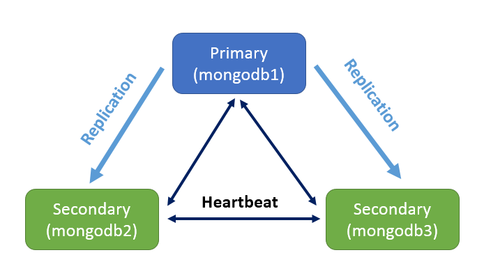
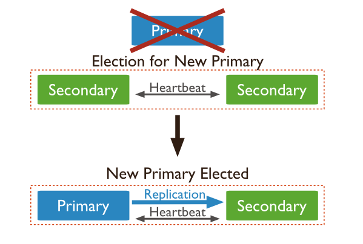
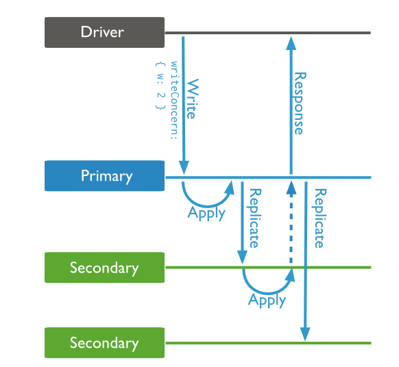

# MongoDB HA (Replication) Test with Pymongo


## 1 实验环境搭建

三台Ubuntu 14.04 64bit Server。

```
$ lsb_release -a
No LSB modules are available.
Distributor ID: Ubuntu
Description:    Ubuntu 14.04.1 LTS
Release:        14.04
Codename:       trusty
```

Mongodb version db version v2.6.7.

Pymongo version 2.7


### 1.1 Install mongodb

在三台机器上安装mongodb

```
$ sudo apt-key adv --keyserver hkp://keyserver.ubuntu.com:80 --recv 7F0CEB10
$ echo 'deb http://downloads-distro.mongodb.org/repo/ubuntu-upstart dist 10gen' | sudo tee /etc/apt/sources.list.d/mongodb.list
$ sudo apt-get update
$ sudo apt-get install -y mongodb-org
```

### 1.2 Configure mongodb

我们要配置一个三个节点的Replication，如下所示：



#### 1.2.1 三个节点能相互通信，配置DNS。

三台机器的hostname分别为：`mongodb1` `mongodb2` `mongodb3`

配置host：
```
$ more /etc/hosts
127.0.0.1       localhost
10.75.44.10 mongodb1
10.75.44.11 mongodb2
10.75.44.12 mongodb3
```

保证之间能相互ping通：
```
$ ping mongodb1
PING mongodb1 (10.75.44.10) 56(84) bytes of data.
64 bytes from mongodb1 (10.75.44.10): icmp_seq=1 ttl=64 time=0.037 ms
^C
--- mongodb1 ping statistics ---
1 packets transmitted, 1 received, 0% packet loss, time 0ms
rtt min/avg/max/mdev = 0.037/0.037/0.037/0.000 ms
penxiao@mongodb1:~$ ping mongodb2
PING mongodb2 (10.75.44.11) 56(84) bytes of data.
64 bytes from mongodb2 (10.75.44.11): icmp_seq=1 ttl=64 time=0.277 ms
^C
--- mongodb2 ping statistics ---
1 packets transmitted, 1 received, 0% packet loss, time 0ms
rtt min/avg/max/mdev = 0.277/0.277/0.277/0.000 ms
penxiao@mongodb1:~$ ping mongodb3
PING mongodb3 (10.75.44.12) 56(84) bytes of data.
64 bytes from mongodb3 (10.75.44.12): icmp_seq=1 ttl=64 time=0.193 ms
^C
--- mongodb3 ping statistics ---
1 packets transmitted, 1 received, 0% packet loss, time 0ms
rtt min/avg/max/mdev = 0.193/0.193/0.193/0.000 ms
```

#### 1.2.2. 配置mongodb

尽量使用MongoDB默认端口`27017`. 使用`bind_ip`配置选项配置绑定的IP地址，能让三个节点相互访问。


1) 启动三个mongodb进程

修改三台host的mongodb1的配置： 添加一个相同的replicate set的名字:`rs1`。
```
$ more /etc/mongod.conf
replSet=rs1
```

启动三台host的mongod进程

```
$ sudo service mongod start/restart
```


2) 然后进到mongodb1的mongo shell里初始化配置。
```
penxiao@mongodb1:~$ mongo
MongoDB shell version: 2.6.7
connecting to: test
> 
> 
> use adminuse admin
switched to db admin
> rs.conf()rs.conf()
null
> rs.status()
{
        "startupStatus" : 3,
        "info" : "run rs.initiate(...) if not yet done for the set",
        "ok" : 0,
        "errmsg" : "can't get local.system.replset config from self or any seed (EMPTYCONFIG)"
}
> 
> 
> rs.initiate()
{
        "info2" : "no configuration explicitly specified -- making one",
        "me" : "mongodb1:27017",
        "info" : "Config now saved locally.  Should come online in about a minute.",
        "ok" : 1
}
> rs.status()
{
        "set" : "rs1",
        "date" : ISODate("2015-01-16T02:45:35Z"),
        "myState" : 1,
        "members" : [
                {
                        "_id" : 0,
                        "name" : "mongodb1:27017",
                        "health" : 1,
                        "state" : 1,
                        "stateStr" : "PRIMARY",
                        "uptime" : 510,
                        "optime" : Timestamp(1421376326, 1),
                        "optimeDate" : ISODate("2015-01-16T02:45:26Z"),
                        "electionTime" : Timestamp(1421376326, 2),
                        "electionDate" : ISODate("2015-01-16T02:45:26Z"),
                        "self" : true
                }
        ],
        "ok" : 1
}
rs1:PRIMARY> 
```

可以看到此时因为只有一个member，并且本身就是`PRIMARY`.


2) 添加member

把另外两台host添加进来。
```
rs1:PRIMARY> rs.add('mongodb2')
{ "ok" : 1 }
rs1:PRIMARY> rs.add('mongodb3')
{ "ok" : 1 }
rs1:PRIMARY>
rs1:PRIMARY> rs.conf()
{
        "_id" : "rs1",
        "version" : 3,
        "members" : [
                {
                        "_id" : 0,
                        "host" : "mongodb1:27017"
                },
                {
                        "_id" : 1,
                        "host" : "mongodb2:27017"
                },
                {
                        "_id" : 2,
                        "host" : "mongodb3:27017"
                }
        ]
}
rs1:PRIMARY> rs.status()
{
        "set" : "rs1",
        "date" : ISODate("2015-01-16T02:48:36Z"),
        "myState" : 1,
        "members" : [
                {
                        "_id" : 0,
                        "name" : "mongodb1:27017",
                        "health" : 1,
                        "state" : 1,
                        "stateStr" : "PRIMARY",
                        "uptime" : 691,
                        "optime" : Timestamp(1421376444, 1),
                        "optimeDate" : ISODate("2015-01-16T02:47:24Z"),
                        "electionTime" : Timestamp(1421376326, 2),
                        "electionDate" : ISODate("2015-01-16T02:45:26Z"),
                        "self" : true
                },
                {
                        "_id" : 1,
                        "name" : "mongodb2:27017",
                        "health" : 1,
                        "state" : 2,
                        "stateStr" : "SECONDARY",
                        "uptime" : 99,
                        "optime" : Timestamp(1421376444, 1),
                        "optimeDate" : ISODate("2015-01-16T02:47:24Z"),
                        "lastHeartbeat" : ISODate("2015-01-16T02:48:35Z"),
                        "lastHeartbeatRecv" : ISODate("2015-01-16T02:48:35Z"),
                        "pingMs" : 0,
                        "syncingTo" : "mongodb1:27017"
                },
                {
                        "_id" : 2,
                        "name" : "mongodb3:27017",
                        "health" : 1,
                        "state" : 2,
                        "stateStr" : "SECONDARY",
                        "uptime" : 72,
                        "optime" : Timestamp(1421376444, 1),
                        "optimeDate" : ISODate("2015-01-16T02:47:24Z"),
                        "lastHeartbeat" : ISODate("2015-01-16T02:48:36Z"),
                        "lastHeartbeatRecv" : ISODate("2015-01-16T02:48:35Z"),
                        "pingMs" : 0,
                        "syncingTo" : "mongodb1:27017"
                }
        ],
        "ok" : 1
}
rs1:PRIMARY>
```

结果可以看到mongodb1是`PRIMARY`，其它两个host是`SECONDARY`。

至此mongodb的配置完成了。


## 2 测试内容

### 2.1 Test case 1: Basic operations

测试对Replica Set的基本连接，以及基本写操作，和Failover后的恢复操作，
使用[pymongo](http://api.mongodb.org/python/current/examples/high_availability.html)



Connecting to a Replica Set

```python
>>> from pymongo import MongoClient
>>> MongoClient("10.75.44.10", replicaset='rs1')
MongoClient([u'mongodb2:27017', u'mongodb1:27017', u'mongodb3:27017'])
>>> 
```

对数据库进行基本的写操作：

``` python
>>> from pymongo import MongoClient
>>> db = MongoClient("10.75.44.10", replicaset='rs1').demo
>>> db
Database(MongoClient([u'mongodb2:27017', u'mongodb1:27017', u'mongodb3:27017']), u'demo')
>>> db.connection.host
'10.75.44.10'
>>> db.connection.port
27017
>>>
```

看到目前对于数据库的操作是`PRIMARY`，也就是host `mongodb1`。 然后对数据库写入一条record：

```python
>>> db.test.insert({'x':1})
ObjectId('54b8b1a1c77b3b3b354869a3')
>>> db.test.find_one()
{u'x': 1, u'_id': ObjectId('54b8b1a1c77b3b3b354869a3')}
>>> 
```

此时，把`mongodb1`的mongod stop掉。

```python
>>> db.test.find_one()
Traceback (most recent call last):
  File "<stdin>", line 1, in <module>
  File "/usr/local/lib/python2.7/dist-packages/pymongo/collection.py", line 713, in find_one
    for result in cursor.limit(-1):
  File "/usr/local/lib/python2.7/dist-packages/pymongo/cursor.py", line 1038, in next
    if len(self.__data) or self._refresh():
  File "/usr/local/lib/python2.7/dist-packages/pymongo/cursor.py", line 982, in _refresh
    self.__uuid_subtype))
  File "/usr/local/lib/python2.7/dist-packages/pymongo/cursor.py", line 906, in __send_message
    res = client._send_message_with_response(message, **kwargs)
  File "/usr/local/lib/python2.7/dist-packages/pymongo/mongo_client.py", line 1186, in _send_message_with_response
    sock_info = self.__socket(member)
  File "/usr/local/lib/python2.7/dist-packages/pymongo/mongo_client.py", line 913, in __socket
    "%s %s" % (host_details, str(why)))
pymongo.errors.AutoReconnect: could not connect to 10.75.44.10:27017: [Errno 111] Connection refused
>>> db.test.find_one()
{u'x': 1, u'_id': ObjectId('54b8b1a1c77b3b3b354869a3')}
>>> db.connection.host
u'mongodb3'
>>> db.connection.port
27017
>>> 
```

发现有个`pymongo.errors.AutoReconnect`的异常，不过马上恢复了，而且此时的操作数据库变成了`mongodb3`，也就是现在的`PRIMARY`.

如果需要从Secondary读取数据，可以设置`ReadPreference`.
``` python
>>> from pymongo.read_preferences import ReadPreference
>>> db.test.find_one()
{u'x': 1, u'_id': ObjectId('54b8b1a1c77b3b3b354869a3')}
>>> db.test.find_one(read_preference=ReadPreference.SECONDARY)
{u'x': 1, u'_id': ObjectId('54b8b1a1c77b3b3b354869a3')}
>>> 
```


### 2.2 Test case 2: PRIMARY lost connection with all SECONDARY

假如PRIMARY和其它所有的SECONDARY失去联系了，那么PRIMARY就无法进行读写操作了。

```python
>>> db.test.insert({'x':3})
Traceback (most recent call last):
  File "<stdin>", line 1, in <module>
  File "/usr/local/lib/python2.7/dist-packages/pymongo/collection.py", line 402, in insert
    gen(), check_keys, self.uuid_subtype, client)
  File "/usr/local/lib/python2.7/dist-packages/pymongo/mongo_client.py", line 1125, in _send_message
    raise AutoReconnect(str(e))
pymongo.errors.AutoReconnect: not master
>>> 
>>> 
>>> 
>>> 
>>> db.test.insert({'x':3})
Traceback (most recent call last):
  File "<stdin>", line 1, in <module>
  File "/usr/local/lib/python2.7/dist-packages/pymongo/collection.py", line 363, in insert
    client._ensure_connected(True)
  File "/usr/local/lib/python2.7/dist-packages/pymongo/mongo_client.py", line 924, in _ensure_connected
    self.__ensure_member()
  File "/usr/local/lib/python2.7/dist-packages/pymongo/mongo_client.py", line 797, in __ensure_member
    member, nodes = self.__find_node()
  File "/usr/local/lib/python2.7/dist-packages/pymongo/mongo_client.py", line 888, in __find_node
    raise AutoReconnect(', '.join(errors))
pymongo.errors.AutoReconnect: [Errno 111] Connection refused, [Errno 111] Connection refused, mongodb3:27017 is not primary or master
>>> 
```

直到有至少两个Replica Set的host连接，然后选出新的PRIMARY。

### 2.3 Test case 3: Write Concern

根据[Write Concern for Replica Sets](http://docs.mongodb.org/manual/core/replica-set-write-concern/)的介绍：



[pymongo write concern](http://api.mongodb.org/python/current/api/pymongo/database.html#pymongo.database.Database.write_concern)

```python
>>> db
Database(MongoClient([u'mongodb2:27017', u'mongodb1:27017', u'mongodb3:27017']), u'demo')
>>> db.write_concern
{}
>>> db.write_concern = {'w':2, 'wtimeout':5000}
>>> db.write_concern
{'wtimeout': 5000, 'w': 2}
>>> db.test.insert({'y':2})
ObjectId('54b8b89dc77b3b3b354869a4')
```

默认的write concern是空的配置。write concern有四个参数：`w`,`wtimeout`,`j`, `fsync`。

其中比较重要的是`w`和`wtimeout`。

`w`: (integer or string)If this is a replica set, write operations will block until they have been replicated to the specified 
number or tagged set of servers. w=<int> always includes the replica set primary (e.g. w=3 means write to 
the primary and wait until replicated to two secondaries). Setting w=0 disables write acknowledgement and 
all other write concern options.

`wtimeout`: (integer) Used in conjunction with w. Specify a value in milliseconds to control how long to wait for write 
propagation to complete. If replication does not complete in the given timeframe, a timeout exception is raised.


## Reference

[Three Member Replica Sets from mongodb.org](http://docs.mongodb.org/manual/core/replica-set-architecture-three-members/)

[http://docs.mongodb.org/manual/replication/](http://docs.mongodb.org/manual/replication/)

[How to Setup MongoDB Replication Using Replica Set and Arbiters](http://www.thegeekstuff.com/2014/02/mongodb-replication/)

[pymongo documentation](http://api.mongodb.org/python/current/api/)
